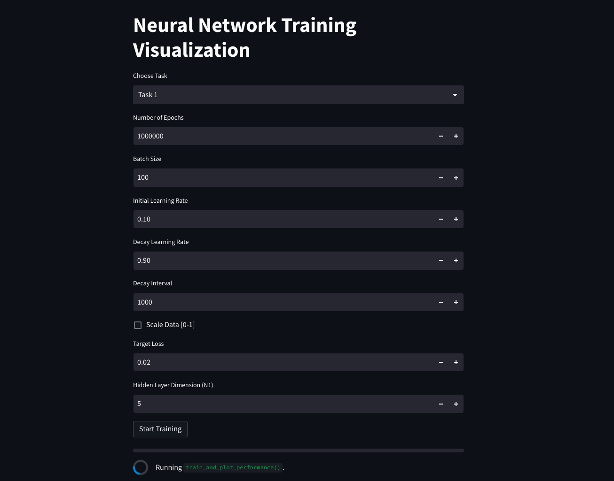
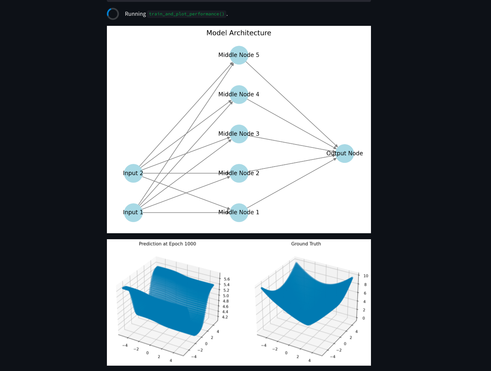

# EML Homework 1

This repository contains the solutions for the first homework assignment of the EML  lecture.

## Files

- `Task 1.py`: Contains the NumPy implementation for Task 1, including Gradient Clipping.
- `Task 2.py`: Contains the NumPy implementation for Task 2.
- `streamlit-main.py`: File for easier usage and visual representation.

## Streamlit visualization
Streamlit is an open-source Python library that makes it easy to create and share custom web apps for machine learning and data science. In this homework, I used streamlit to visualize the results and training process of the first two tasks.
Both tasks do however work with the files `Task 1.py` and `Task 2.py` as well.
The Streamlit Visualization functions as a tool that was created while playing around with the tasks.





## The Code
  
### Execution

To execute the code, follow these instructions:

- Task 1:
  ```
  python task_1.py
  ```
  
- Task 2:
  ```
  python task_2.py
  ```

- Streamlit Visualization:

  ```
  streamlet run streamlet-main.py
  ```

### Saving Weights and Biases

In Task 1, a specific loss needs to be achieved. The script is designed to train with different N1 values. Once the target loss is reached, the training will stop, and the weights and biases will be saved as a`npy-file`.

### Adaptive Learning Rate

Both training scripts (`Task 1.py` and `Task 2.py`) have an adaptive learning rate feature. If the loss does not improve over the last N epochs, the learning rate is multiplied by a certain value to decrease it.

### Gradient Clipping

Task 1 implementation includes Gradient Clipping, which helps prevent exploding gradients during training.
This was mentioned in the last lecture but I didn't have  the time to also implement it in task 2.

### Only use best weights anf biases

Just because a network is trained for say 1000 epochs, it doesn't mean that the weights and biases at the 1000th epoch are the best ones. The network might have overfitted and the weights and biases at the 500th epoch might be better. Therefore, the script only saves the weights and biases if the loss is the lowest one so far.
The best weights and biases are chosen based on the loss after the training phase.
Here I used the training loss although a validation loss would be better.


## gradient derivation
The following shows the mathematical derivation for the backpropagation allgorithm for task 1 & 2.
### Task 1

Let's denote:

- $x$ as the input to the network.
- $W_1$ and $b_1$ as the weights and bias of the hidden layer.
- $W_2$ and $b_2$ as the weights and bias of the output layer.
- $z_1 = W_1x + b_1$ as the weighted sum in the hidden layer.
- $h = \sigma(z_1)$ as the output of the hidden layer after applying the sigmoid activation function.
- $z_2 = W_2h + b_2$ as the weighted sum in the output layer.
- $\hat{y} = z_2$ as the output of the network (since there's no activation function in the output layer).
- $L = \frac{1}{2}(y - \hat{y})^2$ as the quadratic loss function, where $y$ is the true target.

We want to compute the gradients $\frac{\partial L}{\partial W_1}$, $\frac{\partial L}{\partial b_1}$, $\frac{\partial L}{\partial W_2}$, and $\frac{\partial L}{\partial b_2}$.

1. **Output Layer**:

   Using the chain rule, we have:

   $$\frac{\partial L}{\partial W_2} = \frac{\partial L}{\partial \hat{y}} \cdot \frac{\partial \hat{y}}{\partial z_2} \cdot \frac{\partial z_2}{\partial W_2} = (\hat{y} - y) \cdot 1 \cdot h = (\hat{y} - y)h$$

   $$\frac{\partial L}{\partial b_2} = \frac{\partial L}{\partial \hat{y}} \cdot \frac{\partial \hat{y}}{\partial z_2} \cdot \frac{\partial z_2}{\partial b_2} = (\hat{y} - y) \cdot 1 \cdot 1 = \hat{y} - y$$

2. **Hidden Layer**:

   Again using the chain rule, we have:

   $$\frac{\partial L}{\partial W_1} = \frac{\partial L}{\partial \hat{y}} \cdot \frac{\partial \hat{y}}{\partial z_2} \cdot \frac{\partial z_2}{\partial h} \cdot \frac{\partial h}{\partial z_1} \cdot \frac{\partial z_1}{\partial W_1} = (\hat{y} - y) \cdot 1 \cdot W_2 \cdot \sigma'(z_1) \cdot x = (\hat{y} - y)W_2\sigma'(z_1)x$$

   $$\frac{\partial L}{\partial b_1} = \frac{\partial L}{\partial \hat{y}} \cdot \frac{\partial \hat{y}}{\partial z_2} \cdot \frac{\partial z_2}{\partial h} \cdot \frac{\partial h}{\partial z_1} \cdot \frac{\partial z_1}{\partial b_1} = (\hat{y} - y) \cdot 1 \cdot W_2 \cdot \sigma'(z_1) \cdot 1 = (\hat{y} - y)W_2\sigma'(z_1)$$

   where$\sigma'(z_1)$ is the derivative of the sigmoid function with respect to $z_1$, which is given by $\sigma'(z_1) = \sigma(z_1)(1 - \sigma(z_1))$.

Once we have the gradients, we can use them to update the weights and biases. This is done using the gradient descent update rule:

1. **Output Layer**:

   The weights and bias of the output layer are updated as follows:

   $$W_2 = W_2 - \text{lr} \cdot \frac{\partial L}{\partial W_2} = W_2 - \text{lr} \cdot (\hat{y} - y)h$$

   $$b_2 = b_2 - \text{lr} \cdot \frac{\partial L}{\partial b_2} = b_2 - \text{lr} \cdot (\hat{y} - y)$$

2. **Hidden Layer**:

   The weights and bias of the hidden layer are updated as follows:

   $$W_1 = W_1 - \text{lr} \cdot \frac{\partial L}{\partial W_1} = W_1 - \text{lr} \cdot (\hat{y} - y)W_2\sigma'(z_1)x$$

   $$b_1 = b_1 - \text{lr} \cdot \frac{\partial L}{\partial b_1} = b_1 - \text{lr} \cdot (\hat{y} - y)W_2\sigma'(z_1)$$


### Task 2
Let's denote:

- $x$ as the input to the network.
- $W_1$ and $b_1$ as the weights and bias of the hidden layer.
- $W_2$ and $b_2$ as the weights and bias of the output layer.
- $z_1 = W_1x + b_1$ as the weighted sum in the hidden layer.
- $h = \sigma(z_1)$ as the output of the hidden layer after applying the sigmoid activation function.
- $z_2 = W_2h + b_2$ as the weighted sum in the output layer.
- $\hat{y} = \text{softmax}(z_2)$ as the output of the network after applying the softmax activation function.
- $L = -\sum_{i} y_i \log(\hat{y}_i)$ as the cross-entropy loss function, where $y$ is the true target.

We want to compute the gradients $\frac{\partial L}{\partial W_1}$, $\frac{\partial L}{\partial b_1}$, $\frac{\partial L}{\partial W_2}$, and $\frac{\partial L}{\partial b_2}$.

1. **Output Layer**:

   Using the chain rule, we have:

   $$\frac{\partial L}{\partial W_2} = \frac{\partial L}{\partial \hat{y}} \cdot \frac{\partial \hat{y}}{\partial z_2} \cdot \frac{\partial z_2}{\partial W_2} = (\hat{y} - y) \cdot h$$

   $$\frac{\partial L}{\partial b_2} = \frac{\partial L}{\partial \hat{y}} \cdot \frac{\partial \hat{y}}{\partial z_2} \cdot \frac{\partial z_2}{\partial b_2} = \hat{y} - y$$

2. **Hidden Layer**:

   Again using the chain rule, we have:

   $$\frac{\partial L}{\partial W_1} = \frac{\partial L}{\partial \hat{y}} \cdot \frac{\partial \hat{y}}{\partial z_2} \cdot \frac{\partial z_2}{\partial h} \cdot \frac{\partial h}{\partial z_1} \cdot \frac{\partial z_1}{\partial W_1} = (\hat{y} - y) \cdot W_2 \cdot \sigma'(z_1) \cdot x$$

   $$\frac{\partial L}{\partial b_1} = \frac{\partial L}{\partial \hat{y}} \cdot \frac{\partial \hat{y}}{\partial z_2} \cdot \frac{\partial z_2}{\partial h} \cdot \frac{\partial h}{\partial z_1} \cdot \frac{\partial z_1}{\partial b_1} = (\hat{y} - y)\cdot W_2 \cdot \sigma'(z_1)$$

   where $\sigma'(z_1)$ is the derivative of the sigmoid function with respect to $z_1$, which is given by $\sigma'(z_1) = \sigma(z_1)(1 - \sigma(z_1))$.

Once we have the gradients, we can use them to update the weights and biases. This is done using the gradient descent update rule:

1. **Output Layer**:

   The weights and bias of the output layer are updated as follows:

   $$W_2 = W_2 - \text{lr} \cdot \frac{\partial L}{\partial W_2} = W_2 - \text{lr} \cdot (\hat{y} - y)h$$

   $$b_2 = b_2 - \text{lr} \cdot \frac{\partial L}{\partial b_2} = b_2 - \text{lr} \cdot (\hat{y} - y)$$

2. **Hidden Layer**:

   The weights and bias of the hidden layer are updated as follows:

   $$W_1 = W_1 - \text{lr} \cdot \frac{\partial L}{\partial W_1} = W_1 - \text{lr} \cdot (\hat{y} - y)W_2\sigma'(z_1)x$$

   $$b_1 = b_1 - \text{lr} \cdot \frac{\partial L}{\partial b_1} = b_1 - \text{lr} \cdot (\hat{y} - y)W_2\sigma'(z_1)$$
